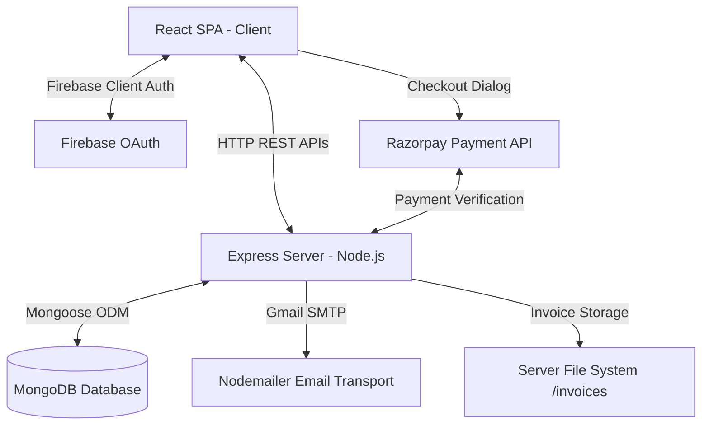

# 📖 Mellow Café - Technical Documentation

This documentation provides a deep technical review of the Mellow Café digital ordering platform. It details the system architecture, database models, API endpoint structures, key transaction logic flows, and reviews a few code discrepancies found in the current implementation.

---

## 🏛️ System Architecture

Mellow Café uses a decoupling client-server architecture:


### 1. Frontend State & Contexts
* **`AuthContext`**: Manages current user session. Serializes authentication details (name, email, profile picture, token) to `localStorage` under `mellowCafeUser` (or `user` depending on auth provider) to persist login state.
* **`CartContext`**: Maintains the shopping cart list. Each item is indexed with a composite `cartId` (which accounts for customized options, e.g. `12-Vanilla` to allow the same product with different variations in the cart). State is persisted in `localStorage` under `mellow-cart`.

### 2. Backend Middleware & Statics
* **Static Assets**: Invoices generated as PDFs are stored locally in the `Server/invoices` folder. The folder is mounted using Express static files middleware under the `/invoices` virtual path:
  ```javascript
  app.use('/invoices', express.static(path.join(__dirname, 'invoices')));
  ```
* **CORS**: Configured with `cors()` default options to allow cross-origin requests from the React development server.

---

## 🗄️ Database Schemas (MongoDB)

All schemas are declared using Mongoose in the `Server/models` directory.

### 1. User Schema (`User.cjs`)
Used for users registered locally through the email-password form.
* **`name`** (String): Full name of the user.
* **`email`** (String, Required, Unique): Email used for auth and OTP communications.
* **`phone`** (String, default `null`): Contact phone number.
* **`password`** (String, default `null`): Hashed password.
* **`provider`** (String, Enum: `["local", "google"]`, default `"local"`): Authentication source.
* **`picture`** (String): Profile image URL.

### 2. Google User Schema (`googleUserModel.cjs`)
Dedicated collection specifically for recording metadata from users logged in via Google OAuth.
* **`name`** (String): Display name returned from Google credentials.
* **`email`** (String, Unique): User's primary Gmail address.
* **`picture`** (String): Google account profile avatar URL.
* **`createdAt`** (Date, default `Date.now`): Timestamp of account creation.

### 3. Orders Schema (`Orders.cjs`)
Keeps track of successfully completed orders.
* **`userEmail`** (String): Email of the customer.
* **`items`** (Array): List of item objects ordered (includes name, price, quantity, option).
* **`total`** (Number): Total purchase price in INR.
* **`timestamp`** (Date, default `Date.now`): Time the transaction was recorded.

---

## 🔌 API Reference

### 1. Authentication Routes (`/api/auth`)

#### `POST /register`
Creates a new local user credentials record.
* **Request Body:**
  ```json
  {
    "name": "Jane Doe",
    "email": "jane@example.com",
    "phone": "9876543210",
    "password": "securepassword123"
  }
  ```
* **Success Response (201 Created):**
  ```json
  {
    "message": "User registered",
    "user": {
      "name": "Jane Doe",
      "email": "jane@example.com",
      "phone": "9876543210",
      "provider": "local",
      "_id": "64c9a8..."
    }
  }
  ```
* **Error Response (400 Bad Request):**
  ```json
  {
    "message": "User already exists. Please login."
  }
  ```

#### `POST /login`
Authenticates local email and password.
* **Request Body:**
  ```json
  {
    "email": "jane@example.com",
    "password": "securepassword123"
  }
  ```
* **Success Response (200 OK):**
  ```json
  {
    "message": "Login success",
    "user": {
      "name": "Jane Doe",
      "email": "jane@example.com",
      "phone": "9876543210",
      "provider": "local"
    }
  }
  ```

#### `POST /google-login`
Registers or signs in a user authenticated via Google OAuth.
* **Request Body:**
  ```json
  {
    "email": "jane.google@gmail.com",
    "name": "Jane Google",
    "picture": "https://lh3.googleusercontent.com/..."
  }
  ```
* **Success Response (200 OK):**
  ```json
  {
    "message": "Google login success",
    "user": {
      "name": "Jane Google",
      "email": "jane.google@gmail.com",
      "provider": "google",
      "picture": "https://lh3.googleusercontent.com/..."
    }
  }
  ```

---

### 2. OTP Verification Routes (`/`)

#### `POST /send-otp`
Generates a 6-digit verification code, stores it in a short-lived JWT, and emails it.
* **Request Body:**
  ```json
  {
    "email": "customer@gmail.com"
  }
  ```
* **Success Response (200 OK):**
  ```json
  {
    "token": "eyJhbGciOiJIUzI1NiIsInR5cCI6IkpXVCJ9..."
  }
  ```
  *(The client must save this token and send it back during verification).*

#### `POST /verify-otp`
Verifies the provided 6-digit OTP code against the payload embedded in the JWT.
* **Request Body:**
  ```json
  {
    "otp": "482015",
    "token": "eyJhbGciOiJIUzI1NiIsInR5cCI6IkpXVCJ9..."
  }
  ```
* **Success Response (200 OK):**
  ```json
  {
    "message": "OTP Verified",
    "email": "customer@gmail.com"
  }
  ```

---

### 3. Payment & Invoicing (`/api/payment`)

#### `POST /create-order`
Initiates a payment order with Razorpay.
* **Request Body:**
  ```json
  {
    "amount": 450
  }
  ```
* **Success Response (200 OK):** Returns the full Razorpay Order object:
  ```json
  {
    "id": "order_ND92h7Bsh2b9",
    "entity": "order",
    "amount": 45000,
    "amount_paid": 0,
    "amount_due": 45000,
    "currency": "INR",
    "receipt": "order_1690800000000",
    "status": "created"
  }
  ```

#### `POST /verify`
Verifies Razorpay payment signature, saves the order to MongoDB, and triggers PDF generation.
* **Request Body:**
  ```json
  {
    "razorpay_order_id": "order_ND92h7Bsh2b9",
    "razorpay_payment_id": "pay_ND93ksj3B2b9",
    "razorpay_signature": "abcdef0123456789...",
    "items": [
      { "id": 1, "name": "Coffee", "price": 35, "quantity": 2 }
    ],
    "totalAmount": 70,
    "userEmail": "customer@example.com"
  }
  ```
* **Success Response (200 OK):**
  ```json
  {
    "success": true,
    "invoiceUrl": "http://localhost:5000/invoices/invoice_64c9bc028a3f.pdf"
  }
  ```

---

### 4. Profiles & History (`/api/profile`)

#### `GET /:email`
Fetches User profile information from either standard or Google User collections.
* **Success Response (200 OK):**
  ```json
  {
    "profile": {
      "name": "Jane Doe",
      "email": "jane@example.com",
      "phone": "9876543210",
      "picture": null,
      "type": "normal"
    }
  }
  ```

#### `GET /orders/:email`
Fetches a list of previous orders matching the customer's email.
* **Success Response (200 OK):**
  ```json
  {
    "orders": [
      {
        "_id": "64c9bc028a3f",
        "userEmail": "jane@example.com",
        "items": [
          { "name": "Coffee", "price": 35, "quantity": 2 }
        ],
        "total": 70,
        "timestamp": "2026-07-30T12:00:00.000Z"
      }
    ]
  }
  ```

---

## 🛠️ Key Logic Walkthroughs

### 1. Transient OTP Authentication Flow
```text
[Client]                      [Server]                    [Email Server]
   |                             |                             |
   |---- 1. POST /send-otp ----->|                             |
   |     (email)                 |                             |
   |                             |-- 2. Generate 6-digit OTP   |
   |                             |   & Sign JWT with OTP/Email |
   |                             |                             |
   |                             |---- 3. Send SMTP Email ---->|
   |                             |     (with OTP in text)      |
   |<--- 4. Return JWT Token ----|                             |
   |     (expires in 5 mins)     |                             |
   |                             |                             |
   |-- 5. User enters OTP ------|                             |
   |---- 6. POST /verify-otp --->|                             |
   |     (otp & token)           |                             |
   |                             |-- 7. jwt.verify(token)      |
   |                             |   Compare decrypted OTP     |
   |<--- 8. OTP Verified OK -----|                             |
```

### 2. Payment Verification & Invoice Creation
When verification completes:
1. Secure SHA256 signature is verified using `crypto`:
   ```javascript
   const body = razorpay_order_id + "|" + razorpay_payment_id;
   const expectedSignature = crypto
     .createHmac("sha256", process.env.RAZORPAY_KEY_SECRET)
     .update(body)
     .digest("hex");
   ```
2. The order is stored in MongoDB.
3. PDFKit is invoked synchronously to write a PDF binary streams directly into `Server/invoices/invoice_[order_id].pdf`.
4. The server returns the absolute local static URL path to the client.

---

## 🔍 Code Review: Identified Discrepancies & Bugs

Here are several code inconsistencies that would prevent smooth operation or cause runtime errors:

### ❌ Bug 1: Unresolved Reference in `CartPage.jsx` (Cart Cleansing)
* **Location:** [`CartPage.jsx` Line 60](file:///c:/MELLOW%20CAFE%20references/Mellow%20Cafe%20project%20official/Client/src/pages/CartPage.jsx#L60)
* **Discrepancy:** The handler calls `clearCart()` when payment is successful. However, `clearCart` is **not** destructured from the `useCart()` hook at the top of the component:
  ```javascript
  const { cartItems, cartTotal, updateQuantity, removeFromCart, cartCount } = useCart();
  ```
* **Effect:** When a payment completes, this triggers a `ReferenceError: clearCart is not defined`, crashing the React runtime.
* **Suggested Fix:** Change the destructured imports in `CartPage.jsx` to:
  ```javascript
  const { cartItems, cartTotal, updateQuantity, removeFromCart, cartCount, clearCart } = useCart();
  ```

### ❌ Bug 2: Missing Cart Total Field in `OrderConfirmationPage.jsx`
* **Location:** [`OrderConfirmationPage.jsx` Line 11 & Line 30](file:///c:/MELLOW%20CAFE%20references/Mellow%20Cafe%20project%20official/Client/src/pages/OrderConfirmationPage.jsx#L11)
* **Discrepancy:** The page attempts to destructure `totalAmount` from `useCart()`:
  ```javascript
  const { clearCart, cartItems, totalAmount } = useCart();
  ```
  However, `CartContext.jsx` exports `cartTotal`, **not** `totalAmount`:
  ```javascript
  const value = { cartItems, addToCart, removeFromCart, updateQuantity, clearCart, cartCount, cartTotal };
  ```
* **Effect:** `totalAmount` is evaluated as `undefined`, causing orders saved directly via `OrderConfirmationPage` routes to have a missing total.
* **Suggested Fix:** Update `OrderConfirmationPage.jsx` to destructure `cartTotal`:
  ```javascript
  const { clearCart, cartItems, cartTotal } = useCart();
  // ... and use cartTotal in the API call payload:
  body: JSON.stringify({
    userEmail,
    items: cartItems,
    total: cartTotal,
  })
  ```

### ⚠️ Code Smell 3: Redundant Invoice Generation Code
* **Files:** [`Server/utils/generateInvoice.cjs`](file:///c:/MELLOW%20CAFE%20references/Mellow%20Cafe%20project%20official/Server/utils/generateInvoice.cjs) and [`Server/routes/generateInvoice.cjs`](file:///c:/MELLOW%20CAFE%20references/Mellow%20Cafe%20project%20official/Server/routes/generateInvoice.cjs)
* **Description:** The project contains two duplicate-like files performing the same task. The one inside `utils` is imported by `paymentRoutes.cjs`, whereas the file in `routes` is not imported anywhere.
* **Suggested Fix:** Remove the unused file in `Server/routes/generateInvoice.cjs` to keep the codebase dry.

### ⚠️ Mongoose Schema vs Verification Data Discrepancy
* **Location:** [`paymentRoutes.cjs` Line 61](file:///c:/MELLOW%20CAFE%20references/Mellow%20Cafe%20project%20official/Server/routes/paymentRoutes.cjs#L61)
* **Description:** When saving verified orders to MongoDB, fields like `totalAmount` and `paymentId` are stored:
  ```javascript
  const order = new Order({
    items,
    totalAmount,
    paymentId: razorpay_payment_id,
    userEmail,
  });
  ```
  However, the `Orders.cjs` database schema **only** defines `userEmail`, `items`, `total`, and `timestamp`. Mongoose drops any fields not defined in the schema under default strict settings. Therefore, `paymentId` and `totalAmount` will not be saved into the database, and the total will be null because the document sets `totalAmount` instead of `total`.
* **Suggested Fix:** Update the `Orders.cjs` schema to include these fields:
  ```javascript
  const OrderSchema = new mongoose.Schema({
    userEmail: String,
    items: Array,
    total: Number,
    paymentId: String,
    timestamp: { type: Date, default: Date.now }
  });
  ```
  And map `total` instead of `totalAmount` in `paymentRoutes.cjs`.
